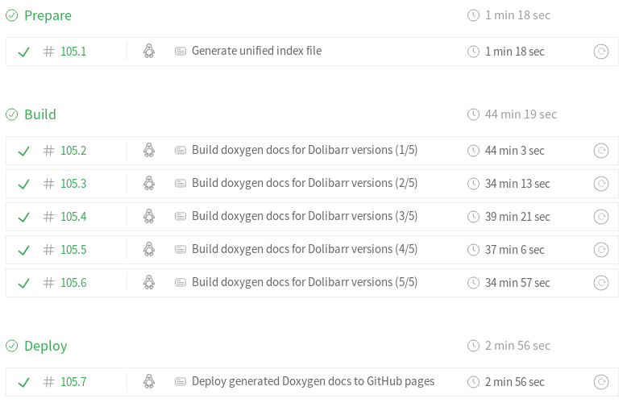
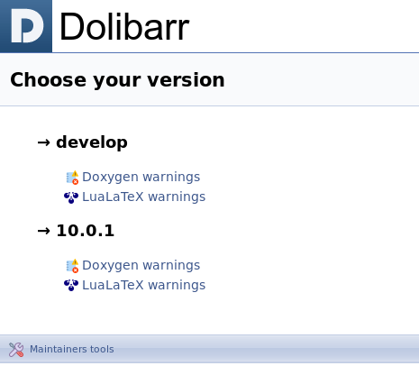

# Dolibarr Doxygen documentation

This repository contain the scripts used by [the Dolibarr project](https://www.dolibarr.org/) to generate automatically every day the [Doxygen documentation](http://www.doxygen.nl/) of the project and publish it on [GitHub Pages](https://pages.github.com/) (branch [gh-pages](https://github.com/Dolibarr/doxygen/tree/gh-pages) of this repository) using the [Travis CI](https://travis-ci.org) continuous integration and deployment service and its [Cron Jobs feature](https://docs.travis-ci.com/user/cron-jobs/).

## [Travis CI](https://travis-ci.org/dolibarr/doxygen) [](https://travis-ci.org/Dolibarr/doxygen)

* [See the last builds on Travis CI](https://travis-ci.org/dolibarr/doxygen/builds)

### Build matrix



The build matrix is composed of three **stages** :
1. The first stage : **Prepare**, is responsible for the creation of the index.html file that allow users to select a particular version of the documentation like the one presented below :<br><br>
<br><br>
1. The second stage : **Build**, is responsible for effectively building the documentation (both HTML and PDF versions). The five jobs are ran in parallel as soon as the **Prepare** stage is successful.<br><br>
1. The third and final stage : **Deploy**, is responsible for the effective deployment of the generated files on [GitHub Pages service](https://pages.github.com/) as soon as the **Build** stage is successful (all 5 jobs of the stage succeeded).

#### Some more info about the Build stage

##### Defining the versions to build

* The versions of the documentation to build can be either [a valid Dolibarr branch name](https://github.com/Dolibarr/dolibarr/branches) or a [a valid Dolibarr tag name](https://github.com/Dolibarr/dolibarr/tags).
* The versions of the documentation to build MUST be putted in the file [versions/dolibarrVersions](versions/dolibarrVersions).
* The file [versions/dolibarrVersions](versions/dolibarrVersions) MUST contain ONLY valid branches or tags names and ONLY one per line.

###### Notes

Theoretically, the number of versions that can be processed by the script is not limited. 

However, it is **strongly advised** not to generate more that 5 versions without editing the [.travis.yml](.travis.yml) file to add more jobs in the **Build** stage and edit the line 13 of the [generateDoxygenForVersions.sh](generateDoxygenForVersions.sh) to match the number of jobs in the **Build** stage. 

For example replace 
```bash
split --numeric-suffixes=1 -n l/5 dolibarrVersions versions
```
 by 
 ```bash
 split --numeric-suffixes=1 -n l/10 dolibarrVersions versions
 ```
if you have added 5 more jobs to the **Build** stage into the [.travis.yml](.travis.yml) file. 

----
As of now, we MUST keep **only one version processed by job** because of the [time limitations enforced by Travis CI](https://docs.travis-ci.com/user/customizing-the-build/#build-timeouts) (a job is automatically terminated and marked as errored if it exceeds 50min.).

Generating one version HTML doc + PDF version using [LuaLaTex](http://www.luatex.org/) can take **up to** 45min.

##### More about the [`dolibarr/doxygen`](https://hub.docker.com/r/dolibarr/doxygen) [Docker](https://docs.docker.com/engine/docker-overview/) [image](https://docs.docker.com/glossary/?term=image)

[](https://microbadger.com/images/dolibarr/doxygen:1.8.16) [](https://microbadger.com/images/dolibarr/doxygen:1.8.16)

You may have noticed that we use a custom [`dolibarr/doxygen`](https://hub.docker.com/r/dolibarr/doxygen) [Docker](https://docs.docker.com/engine/docker-overview/) [image](https://docs.docker.com/glossary/?term=image) for generating the documentation using [Doxygen](http://www.doxygen.nl/).

* This [Docker](https://docs.docker.com/engine/docker-overview/) [image](https://docs.docker.com/glossary/?term=image) is based on [Alpine Linux](https://alpinelinux.org/about/) [Edge](https://wiki.alpinelinux.org/wiki/Edge) branch.
* This [Docker](https://docs.docker.com/engine/docker-overview/) [image](https://docs.docker.com/glossary/?term=image) builds [Doxygen](http://www.doxygen.nl/) from the latest version published sources (currently 1.8.16).
* This [Docker](https://docs.docker.com/engine/docker-overview/) [image](https://docs.docker.com/glossary/?term=image) is shipped with the [TeX Live](https://www.tug.org/texlive/) distribution to be able to compile .tex files (and generate [Doxygen](http://www.doxygen.nl/) PDF documentation that are based of LaTeX files)
* The [Dockerfile](https://docs.docker.com/glossary/?term=Dockerfile) used to build this image [is publicly available](https://hub.docker.com/r/dolibarr/doxygen/dockerfile).

## Download .zip file of HTML version (offline usage)

This repository is mirrored to [gitlab.com/jtraulle/dolibarr-doxygen](https://gitlab.com/jtraulle/dolibarr-doxygen) to be able to use the [Gitlab](https://about.gitlab.com/what-is-gitlab/) built-in feature that allows to download only a specific folder of a Git repository as an archive.

## Build logs 

[Doxygen](http://www.doxygen.nl/) and [LuaLaTex](http://www.luatex.org/) build logs (warnings) are kept for each version generated and can be accessed by clicking the **Maintainers tools** link in the footer of the version selection generated page.

